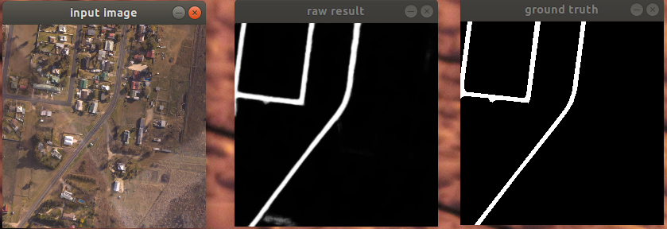

# Road Segmentation U-Net
 

### Goal:
Summer internship project by Tom Vecchi. 
The goal of the code is to generate semantic segmentation masks for roads in aerial imagery, which can then be used as input features to the point classifier.

### Example:

Left: Input image (256x256x5, RGB+dx+dy). 
Centre: Predicted mask output (256x256 grayscale).
Right: Ground truth mask (256x256 grayscale).

### Description:
The neural network takes in 256x256 pixel "tiles" corresponding to an area of 400x400 m. Tiles can have variable numbers of channels: either 
1. the standard 3 channel RGB colour image, 
2. a 2 channel grid of DTM gradients in the x- and y-axes, or 
3. a 5 channel image comprising both RGB and DTM data. 

I used [this github repo](https://github.com/mrgloom/keras-semantic-segmentation-example/blob/master/binary_segmentation/binary_crossentropy_example.py) as a starting point. I also got the data augmentation code and U-Net version 3 from [here](https://github.com/zhixuhao/unet).

### Expected folders:
All code assumes the following subdirectories exist:

 1 ./training : training data
 > training/rgb: png image tiles
 
 > training/txt: txt heightmap tiles
 
 > training/mask: ground truth tiles
  
 2 ./past_models: pretrained models with  weights
  > past_models/5layer_400x28.h5
  
  > past_models/dxy_500x28.h5
  
  > past_models/rgb_500x14.h5
  
  
3 ./unseen: extra test images

> unseen/rgb: png image tiles

> unseen/txt: txt heightmap tiles 

   

### Usage
#### Training a model

`python [5layer | xy | rgb]_classifier.py -m train --unet-version 1 --steps [int] --epochs [int] `

Choose between the three versions depending on which input channels you want to use- 5 layers, DTM-only, or RGB-only. 
 
The -m (mode) argument determines what the script does. To train the network, use `train`.

You can choose between different (untrained) u-net implementations using the `--unet-version` argument.

 After all training epochs are completed, the script will save the final model and weights as `[rgb | dxy | 5layer].h5`in the current directory.
 
 It will then use the model it's just trained to generate a prediction and display it on the screen, along with the input and ground truth (if available).

__Options:__

`--unet-version/-v [int]`: Which *untrained* unet implementation to use, see models.py for details. Give an int from 1 to 3. If unspecified, defaults to the corresponding model in ./past_models.

  `--steps [int] --epochs [int]` How long to train the network for, see the Keras site for details. Defaults: steps=28, epochs=1
  
 `--image/-i [int] `Index of the tile to generate a prediction for. Default: 0
 
 `--unseen/-u [bool]` Whether to use tiles from the ./unseen instead of the ./training folder when predicting. Default: False

#### Notes
Keras imagedatagenerator class requires the number of training images to be an integer multiple of the batch size.

Training images are drawn from the ./training folder using a Keras `imagedatagenerator` to perform real time data augmentation. Validation images are drawn from the same folder but without augmentation. The ./unseen folder doesn't have ground truth and so isn't usable for validation.

#### Predicting from training data
If you give `-m` as `predict`it will skip the training phase and just output a prediction of the image you've specified (using the index and unseen arguments as above).

 
### Predicting from geometry with road_runner.py
I found the classifier.py scripts were quite inconvenient from a usability point of view since the data must be manually extracted and placed in the correct folders before running the neural net. So I wrote a script which combines the data extraction and prediction steps into one automatic package.

It has the following arguments:

`-geometry %s`: KML or WKT geometry file

`-layers %s`: Which channels to use, give one of: rgb, dtm or 5layer

`-outputdir %s`: Directory to save predictions in. Default: Current dir

`-loglevel %s`: Output verbosity, give one of: Normal, Progress or Verbose. Default: Normal

`--show`: Display each predicted tile onscreen as it's generated

`--cleanup`: Delete RGB and txt files after they are used 

Rather than trying to extract data from georepo straight into memory, it creates a temporary working folder and extracts everything there, then optionally deletes all working data after it's used.

### Data 
I trained all the networks on 224 tiles representing mainly suburban, semi-rural and rural areas from Queensland and NSW, with a handful of inner-city tiles as well. 

I experimented with different tile sizes and found that at sizes above 700 m, or below 200m, it was no longer able to highlight roads.

Note that the RGB, DTM, and ground truth tiles must all have the same name (except extension) or else the data will be mismatched.
 
 

### Extras
##### feature_vis.py
The code in this file can be used to run gradient descent on the input pixels while keeping the weights constant. I based this on [an official Keras blog post](https://blog.keras.io/how-convolutional-neural-networks-see-the-world.html).
 
 
##### util.py
The util.py file contains various miscellaneous code that can be used by all 3 scripts.
 